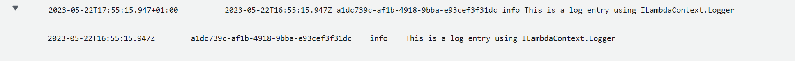
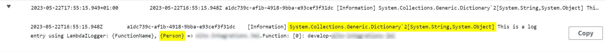
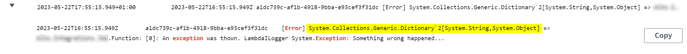
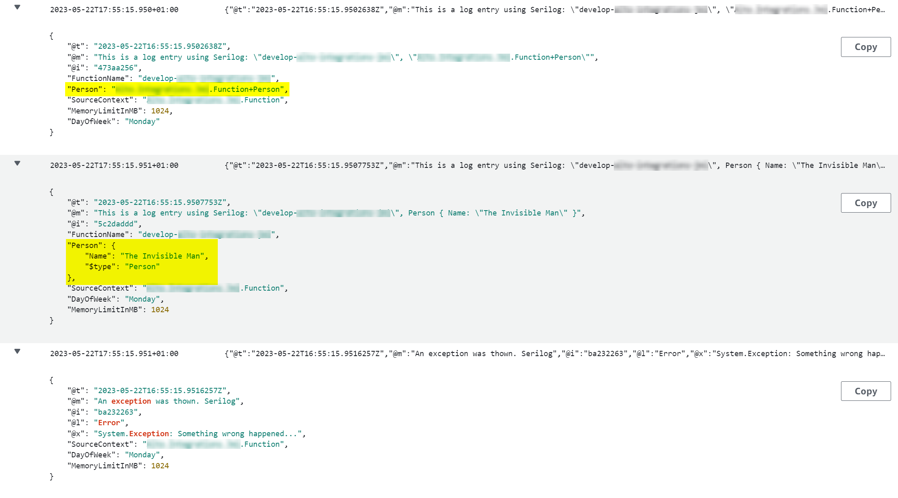
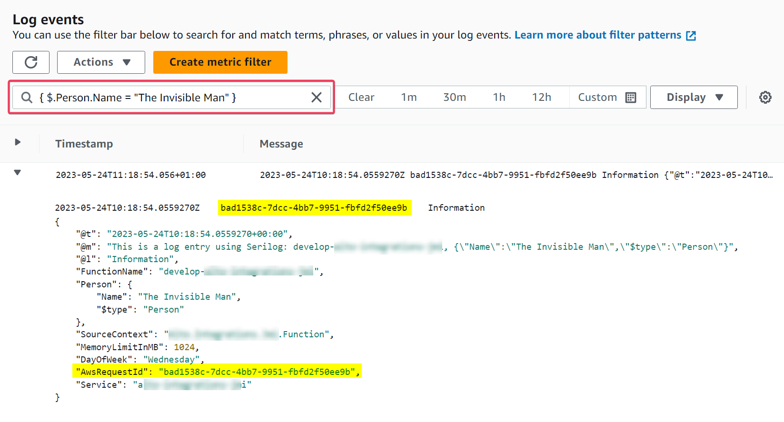
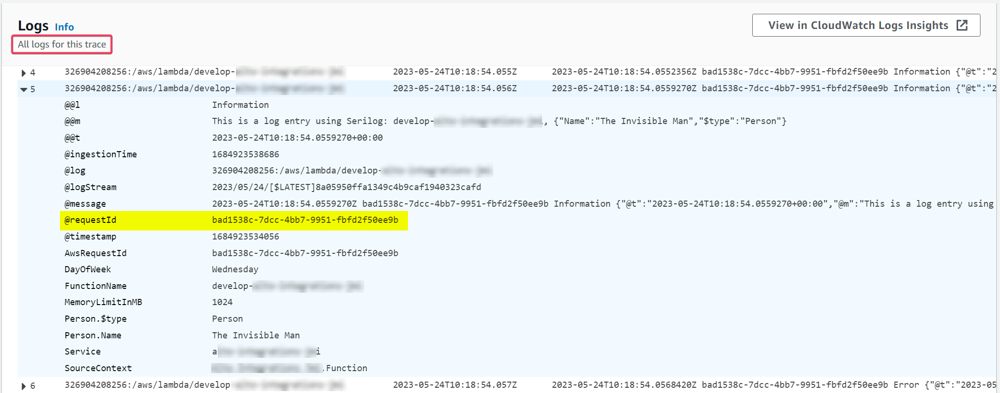
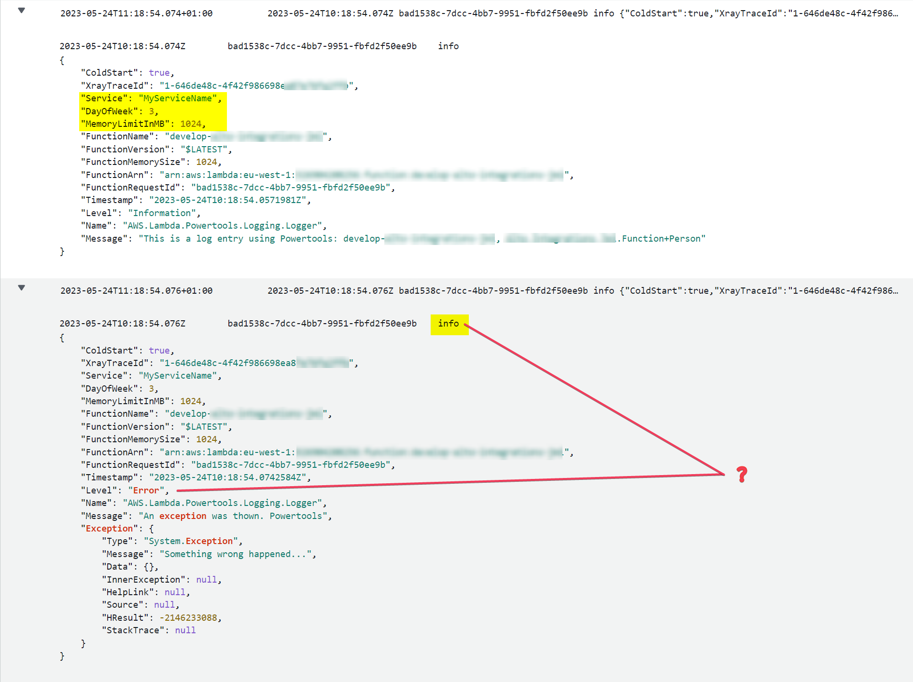

This article discusses four different ways of sending logs to [Cloudwatch](https://aws.amazon.com/cloudwatch/) from a [Lambda](https://aws.amazon.com/lambda) function implemented in .NET.

## Using ILambdaContext.Logger

The [ILambdaLogger](https://github.com/aws/aws-lambda-dotnet/blob/master/Libraries/src/Amazon.Lambda.Core/README.md#ilambdalogger) is the most limited option, but it is also the only one readily available in the lambda without requiring any configuration. It just writes messages in one line, without any specific structure. There is no support to add exceptions when logging errors, or using message template with parameters. This is a good option for a very basic logging needs.

```csharp
public void FunctionHandler(..., ILambdaContext context)
{
    context.Logger.LogLine("This is a log entry using ILambdaContext.Logger");
}
```



## Using LambdaILogger as a Microsoft ILogger

[LambdaILogger](https://github.com/aws/aws-lambda-dotnet/tree/master/Libraries/src/Amazon.Lambda.Logging.AspNetCore#amazonlambdaloggingaspnetcore) is similar to the previous one. It writes messages in one line, but supports message template and exceptions to some extent. Although be careful when passing non-primitive parameters, as objects are not serialised, but just converted to `string` calling the `ToString()` method. Therefore, if the parameter type does not have an impementation for `ToString()`, default one will be used, which by default returns the name of the type. Not very useful when logging. Another benefit of using Microsoft `ILogger` are scopes, which allow to enrich multiple log entries with additional properties.

To use Microsoft `ILogger` you need to add the [NuGet package](https://www.nuget.org/packages/Amazon.Lambda.Logging.AspNetCore) to your project and follow all the dependency injection ceremonies to add and retrieve the `ILogger` implementation to and from the `ServiceCollection`.

```powershell
> dotnet add package Amazon.Lambda.Logging.AspNetCore
```

### Extension methods to support service instantiation

```csharp
public static IConfiguration AddConfiguration(this IServiceCollection services)
{
    var configBuilder = new ConfigurationBuilder()
        .SetBasePath(Directory.GetCurrentDirectory())
        .AddJsonFile("appsettings.json", optional: false);

    return configBuilder.Build();
}

public static IServiceCollection AddLogging(this IServiceCollection services, IConfiguration configuration)
{
    return services.AddLogging(options =>
    {
        var loggerOptions = new LambdaLoggerOptions(configuration);
        options.AddLambdaLogger(loggerOptions);
    });
}
```

### Configuration for LambdaLogger in appsettings.json

```json
{
    "Lambda.Logging": {
        "IncludeCategory": true,
        "IncludeLogLevel": true,
        "IncludeException": true,
        "IncludeEventId": true,
        "IncludeNewline": true,
        "IncludeScopes": true,
        "LogLevel": {
            "Default": "Debug",
            "System": "Information",
            "Microsoft": "Information"
        }
    }
}
```

```csharp
class Person
{
    public string Name { get; set; }
}
    
public void FunctionHandler(..., ILambdaContext context)
{
    // Add ILogger implementation to the ServiceCollection
    var serviceCollection = new ServiceCollection();
    var configuration = serviceCollection.AddConfiguration();
    serviceCollection.AddLogging(configuration);
    
    // Get ILogger implementation from ServiceCollection
    var serviceProvider = serviceCollection.BuildServiceProvider();
    using var scope = serviceProvider.CreateScope();    
    var logger = scope.ServiceProvider.GetRequiredService<ILogger<Function>>();
    
    // Start a new logging scope
    using var scope = logger.BeginScope(
        new Dictionary<string, object> {
            ["DayOfWeek"] = DateTime.Today.DayOfWeek,
            ["MemoryLimitInMB"] = context.MemoryLimitInMB
        });

    logger.LogInformation("This is a log entry using LambdaILogger: {FunctionName}, {Person}", context.FunctionName, new Person { Name = "The Invisible Man" });
    logger.LogError(new Exception("Something wrong happened..."), "An exception was thown. LambdaILogger");
}
```

Alternatively, you can create the logger using the `LoggerFactory` class, bypassing the ceremonies around the `ServiceCollection`.

```csharp
var loggerFactory = LoggerFactory.Create(options =>
{
    var loggerOptions = new LambdaLoggerOptions
    {
        IncludeCategory = true,
        IncludeScopes = true,
        IncludeLogLevel = true
    };
    options.AddLambdaLogger(loggerOptions);
});
var logger = loggerFactory.CreateLogger<Function>();
```




As shown in the previous screenshot from _Cloudwatch_, the `LambdaILogger` relies on the `ToString()` implementation to convert parameters into strings and embed the values into the log message. Although the Microsoft Logging API supports scopes to enrich logs with additional properties, the `LambdaILogger` implementation does not support that very well. The `Person` parameter was completely ignored, and properties in the dictionary used in the scope were not serialised properly.

If you were to use `LambdaILogger`, you must take care of serialising the parameters in the scope and the message.

## Using Serilog

[Serilog](https://serilog.net/) can be used directly or through the Microsoft `ILogger` abstraction. Serilog is a versatile library, highly customisable, therefore it is recomended if you need a high degree of control about the logs format and where to send them. To use Serilog, add the [NuGet package](https://www.nuget.org/packages/Serilog.AspNetCore) to your project.

```powershell
> dotnet add package Serilog.AspNetCore
```

### Configuring Serilog

```csharp
public static IServiceCollection AddLogging(this IServiceCollection services, IConfiguration configuration)
{
    var config = new LoggerConfiguration()
        .MinimumLevel.Is(LogEventLevel.Debug)
        .Enrich.FromLogContext()
        .WriteTo.Console(new RenderedCompactJsonFormatter());

    // Creates the default logger
    Log.Logger = config.CreateLogger();

    // Adds Serilog ILogger provider to ServiceCollection to be used by dependency libraries
    return services.AddLogging(options =>
    {
        options.AddSerilog(dispose: true);
    });
}
```

```csharp
public void FunctionHandler(..., ILambdaContext context)
{
    var logger = Log.ForContext<Function>();
        
    var enrichers = new ILogEventEnricher[]
    {
        new PropertyEnricher("DayOfWeek", DateTime.Today.DayOfWeek),
        new PropertyEnricher("MemoryLimitInMB", context.MemoryLimitInMB)
    };

    using var scope = LogContext.Push(enrichers);
    
    logger.Information("This is a log entry using Serilog: {FunctionName}, {Person}", context.FunctionName, new Person { Name = "The Invisible Man" });
    logger.Information("This is a log entry using Serilog: {FunctionName}, {@Person}", context.FunctionName, new Person { Name = "The Invisible Man" });
    logger.Error(new Exception("Something wrong happened..."), "An exception was thown. Serilog");
}
```

Serilog also has the ability to serialise parameters used in the message template, instead of converting them to string, when name is prefixed with `@`, like `@Person` in the example above.



Unfortunately, to make *Cloudwatch* to correlate logs and traces in *X-Ray* I had to tinker with the message format Serilog uses to write the log entries, to make `AwsRequestId` available in the message in the place and format _Cloudwatch_ is expecting it. I could easily do this using the `ExpressionTemplate` class, one of the strongest extension points in Serilog. 

```csharp
var config = new LoggerConfiguration()
        .MinimumLevel.Is(LogEventLevel.Debug)
        .Enrich.FromLogContext()
        .WriteTo.Console(new ExpressionTemplate("{UtcDateTime(@t):o}\t{AwsRequestId}\t{@l}\t{ {@t, @m, @l, @x, ..@p} }\n"));

Log.Logger = config.CreateLogger();

var logger = Log.ForContext<Function>();
        
    var enrichers = new ILogEventEnricher[]
    {
        new PropertyEnricher("AwsRequestId", context.AwsRequestId),
        new PropertyEnricher("DayOfWeek", DateTime.Today.DayOfWeek),
        new PropertyEnricher("MemoryLimitInMB", context.MemoryLimitInMB)
    };

    using var scope = LogContext.Push(enrichers);
    
    logger.Information("This is a log entry using Serilog: {FunctionName}, {Person}", context.FunctionName, new Person { Name = "The Invisible Man" });
    logger.Information("This is a log entry using Serilog: {FunctionName}, {@Person}", context.FunctionName, new Person { Name = "The Invisible Man" });
    logger.Error(new Exception("Something wrong happened..."), "An exception was thown. Serilog");

```

As you can see in the screenshot below, despite the log entry not being a full JSON object, _Cloudwatch_ support search expressions on the JSON part.



And this way _Cloudwatch_ correlates traces in _X-Ray_ with the logs generated by Serilog.



## Using Lambda Powertools

AWS team has created a suite of utilities called [Powertools](https://awslabs.github.io/aws-lambda-powertools-dotnet/) tailored for AWS Lambda functions. The tools included in this suite help also with other areas of observability, but I will be focusing here only on [logging](https://github.com/awslabs/aws-lambda-powertools-dotnet/tree/main/examples/Logging/).

To use this tool in your Lambda you need to add the [NuGet package](https://www.nuget.org/packages/AWS.Lambda.Powertools.Logging)

```powershell
> dotnet add package AWS.Lambda.Powertools.Logging
```

Then just apply the `Logging` attribute to your function handler, as shown in the example below. This is all that is needed to configure and initialise the Logger in Powertools. Very straightforward.

```csharp
[Logging(LoggerOutputCase = LoggerOutputCase.PascalCase)]
public async Task FunctionHandler(..., ILambdaContext context)
{
    Logger.AppendKey("Service", "MyServiceName");
    Logger.AppendKey("DayOfWeek", DateTime.Today.DayOfWeek);
    Logger.AppendKey("MemoryLimitInMB", context.MemoryLimitInMB);
    Logger.LogInformation(message: "This is a log entry using Powertools: {FunctionName}, {Person}", context.FunctionName, new Person { Name = "The Invisible Man" });
    Logger.LogError(new Exception("Something wrong happened..."), "An exception was thown. Powertools");
}
```



Logs generated by Powertools are written in the format expected by _Cloudwatch_ and are correlated with any traces in _X-Ray_, via the `AwsRequestId` identifier, included by default in the log message. Not sure though why Powertools or _Cloudwatch_ renders the level as `info` when the log level is clearly indicated as `Error`.

## Final thoughts

When it comes to logs, consistency is important when you have multiple applications and services generating logs in a distributed architecture. You want your logs to be searcheable, filterable and human readable to some extent. JSON structured logs seem to fit well in that description, and this is something both Powertools and Serilog provide. The decision about which of these two depends on your scenario. 

If you want a quick, simple and convenient way of sending logs to _Cloudwatch_, then Powertools might be your choice. Just understand this is specific for AWS Lambda functions, and logs format is not too flexible; but this could be good enough for you. 

If you need more control and flexibility on the format and structure of the logs, then you will be better off with Serilog. Another advantage of using Serilog is that it can be wrapped by a Logger Provider and used via the `ILogger` abstraction provided by Microsoft. The biggest benefit of this being that logs written by dependency libraries using the `ILogger` abstraction will follow the same format and contain the same common properties within the scope. Therefore, consistent logs all the way, easier to search, filter and correlate.

Keep dotnetting...